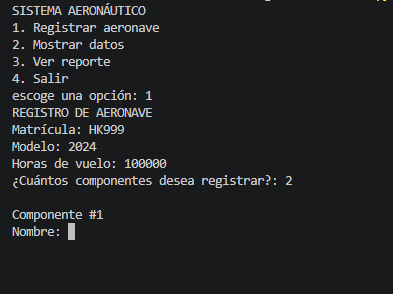
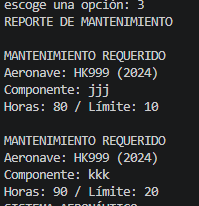

# 📝 Plantilla de Autoevaluación: Gestión de Mantenimiento de Flota Aeronáutica ✈️

**Instrucciones para los estudiantes:**
1. Hagan una copia de este archivo y guárdenlo en la raíz de su repositorio con el nombre `AUTOEVALUACION.md`.
2. Lean cuidadosamente cada criterio de la rúbrica.
3. En el apartado **Nota Esperada**, asignen una calificación numérica (de 0.0 a 5.0) que consideren justa para su trabajo en ese criterio.
4. En el apartado **Justificación**, expliquen con sus propias palabras por qué merecen esa nota. Sean críticos y honestos.
5. En el apartado **Evidencia**, inserten pantallazos de la ejecución de la consola, imágenes de su diagrama o bloques de código (usando la sintaxis de Markdown con \`\`\`) que respalden su justificación.
6. Al final, calculen su nota definitiva esperada según los porcentajes.

---

## 👥 1. Información del Equipo

* **Miembro 1:** [Martín Rivera Salazar] - [000584194]
* **Miembro 2:** [Pablo Andrés Pérez Mejía] - [000571000]

---

## 📊 2. Evaluación por Criterios

### Criterio 1: Diagrama y Lógica (Valor: 20%)
*Evalúa si el diagrama es claro, lógico y representa fielmente la estructura de datos utilizada (listas/diccionarios) y el flujo del programa.*

* **Nota Esperada (0.0 - 5.0):**  5
* **Justificación:** 
  > *El diagrama fue realizado a su cabalidad cumpliendo todos los parametros, con correcciones hechas por el profesor*
* **Evidencia:**
  *Inserta aquí la imagen de tu diagrama (ej. ``) y explica brevemente cómo se conecta con el código.*

### Criterio 2: Uso de Estructuras (Listas y Diccionarios) (Valor: 30%)
*Evalúa si se utilizaron diccionarios y listas de manera correcta y anidada para almacenar los datos ingresados por el usuario, sin redundancias.*

* **Nota Esperada (0.0 - 5.0):**  5
* **Justificación:**
  > *El uso de diccionarios, listas y tuplas fue clave en esta unidad y creemos haber comprendido completamente el tema*
* **Evidencia:**
  *Pega aquí el fragmento de código exacto donde inicializas y llenas estas estructuras. Usa el formato de código de Markdown:*
  ```
  aeronaves = {}

        lista_componentes = []  
 
            componente = {
                "nombre": nombre,
                "datos": datos
            }
           
            lista_componentes.append(componente)
        aeronaves[matricula] = {
            "modelo": modelo,
            "horas": horas,
            "componentes": lista_componentes
        }
´´´

  # ... código de inserción de datos ...

### Criterio 3: Cumplimiento de Restricciones Técnicas (Valor: 20%)
*Evalúa el respeto total a las reglas: uso de ciclos clásicos (for/while), cero uso de list comprehensions, y ninguna librería/función avanzada no vista en clase.*

* **Nota Esperada (0.0 - 5.0):**  5
* **Justificación:**
    > *No utilizamos nada exterior a lo propuesto por el docente ni algo que no hayamos ver en clase*
* **Evidencia:** *Pega un fragmento de código que demuestre cómo iteraste sobre los datos de forma clásica (sin atajos avanzados).*
´´´
    if opcion == "1":
        print("REGISTRO DE AERONAVE")
       
        matricula = input("Matrícula: ")
        modelo = input("Modelo: ")
        horas = float(input("Horas de vuelo: "))
´´´
### Criterio 4: Funcionalidad del Código (Valor: 15%)
*Evalúa si el programa pide datos correctamente, no se "crashea" y genera el reporte final de mantenimiento esperado.*

* **Nota Esperada (0.0 - 5.0):**  5 
* **Justificación:**
    > *El menú principal es facil de usar simplemente por la intuición y cumple todos los requisitos dados*
* **Evidencia:** *Inserta aquí 1 o 2 pantallazos () mostrando la terminal donde se vea:*
*El ingreso manual de datos.*: 
*El reporte final impreso en pantalla con las piezas que requieren mantenimiento.*: 

### Criterio 5: Preparación para Sustentación (Valor: 15%)
*Aunque esta nota la dará el profesor en la entrevista oral, autoevalúen su nivel de preparación y comprensión del código que entregaron.*

* **Nivel de Confianza (Bajo / Medio / Alto):** 4
* **Justificación:**
    > *nos preparamos muy bien para realizar la exposición y la justificación de nuestro código aclarando algunos conceptos que no estaban tan claros, sin embargo el factor presión a la hora de presentar puede jugarnos en contra*
* **Hicimos el código en conjunto para asegurarnos de que los dos entendieramos lo que estabamos haciendo**

### 📈 3. Cálculo de Nota Definitiva Esperada
Multipliquen la nota asignada en cada criterio por su porcentaje respectivo y sumen los resultados para obtener su nota final esperada.

|Criterio	|Nota |Asignada	|Peso	|Subtotal |(Nota * Peso) |
|---|---|---|---|---|---|
|1. Diagrama y Lógica	|5	|20% |(0.2)	|0.2|
|2. Uso de Estructuras	|5	|30% |(0.3)	|0.3|
|3. Cumplimiento Restricciones|	5	|20% |(0.2)	|0.2|
|4. Funcionalidad	|5	|15% |(0.15)	|0.15|
|5. Sustentación (Estimado)|	4|	15%| (0.15)|	0.12|

NOTA FINAL ESPERADA		100%	0.97

✨ ""La educación es para el carácter, no solo para la mente"." ✨